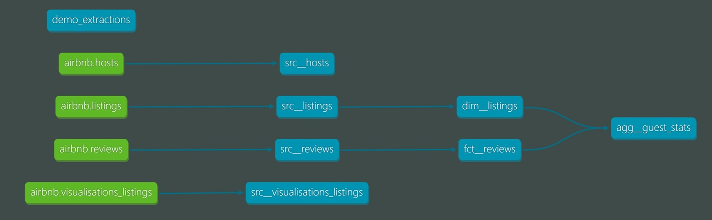

# dbt_airbnb

This project demonstrates how to transform raw Airbnb listing data into a guest-centric data model using dbt. It is designed as a local demo that runs on DuckDB and showcases modular SQL modeling, testing, and documentation practices.

<h3>📚 <a href="https://sergio-data-bi.github.io/dbt_airbnb" target="_blank">Open dbt Generated Documentation</a></h3>

## Overview

The transformation pipeline ingests listing, review, and host data from [Inside Airbnb](https://insideairbnb.com/get-the-data/), restructures it using dbt, and outputs models optimized for analytics around guest behavior and value.

The data is modeled to support:
- Behavioral analysis
- Retention and segmentation
- Price sensitivity and trends

## Project Structure

- `models/`: Core dbt models (dim, fct, and agg layers)
- `macros/`: Custom dbt macros
- `seeds/`: Contains `demo_extractions.csv`, which defines metadata for extracting source data
- `scripts/`: Includes a Python script to download and load data into DuckDB
- `docs/`: Markdown documentation used in the dbt docs site

## Core Models

- `dim__listings`: Dimension table with cleaned listing metadata and pricing
- `fct__reviews`: Fact table of guest reviews linked to listings
- `agg__guest_stats`: Aggregated KPIs at the guest (reviewer) level

## Model Lineage Graph



## Setup Instructions

```bash
pip install -r requirements.txt
python scripts/ingest_airbnb_to_duckdb.py
dbt deps
dbt build
dbt docs generate
```
